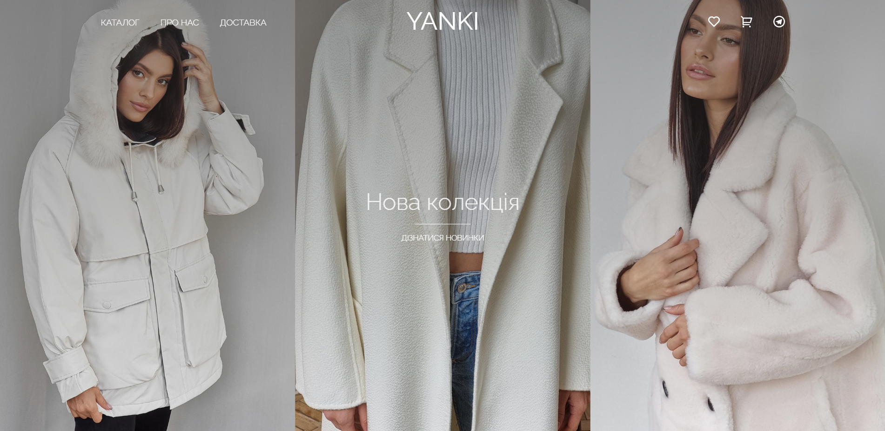

<!-- Project name -->

 

<h1 align="center">:shopping_cart: Yanki Shop :shopping:</h1>

  

    <a href="http://react-shop-swart.vercel.app/">View Demo</a>
    ·
    <a href="https://github.com/Denyska-H/React-Shop/issues">Report Bug</a>
  

<!-- About the project -->

## :bookmark_tabs: About The Project

Yanki Shop is an online e-commerce shop built with <a href="https://reactjs.org/">React</a>

<!-- Technologies -->

## :technologist: Tech Stack Used

- ReactJS 18
- TypeScript
- Redux Toolkit
- React Router
- React Hooks
- Axios
- SCSS-Modules / SASS(SCSS syntax) for styling
- Lodash.Debounce

<!-- Getting started -->

## :desktop_computer: Installation

- Clone the repo with `git clone https://github.com/Denyska-H/React-Shop.git`
- Install all project dependencies with `npm install`
- Start the development server with `npm run start`

<!-- CONTACT -->

## :phone: Contacts

Denys Hleba

- [Instagram](https://www.instagram.com/denys.life9)
- [Telegram](https://t.me/realgemba)
- [LinkedIn](https://www.linkedin.com/in/denys-hleba-853326176/)

Note: This project was bootstrapped with [Create React App](https://github.com/facebook/create-react-app).

(<a href="#top">back to top</a>)

